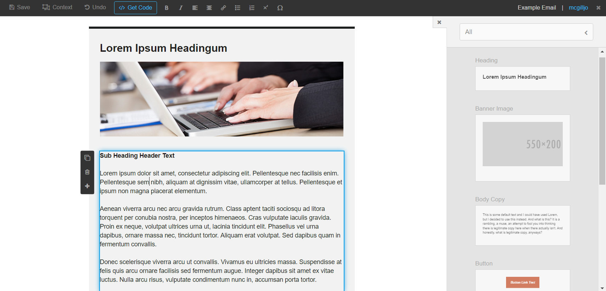

# Contentmint

A decoupled drag-and-drop content editor with a simple API built with Vue.js.



Contentmint is helpful for teams or departments with a variety of processes or tasks that require user generated content but may not need (or may not be able to use) a comprehensive system like Wordpress or Drupal. For instance, your marketing team may use a particular email management tool that does not come with an editor but relies on hand-written HTML files. Contentmint can be tied into a simple back end to make email building simple and clean for the end user. Developers build templates, create components, and add additional hooks and processes via Contentmint's API to design a tool that uniquely fits their stakeholder's needs.

## Take a look
```
git clone https://github.com/jonmcgill/contentmint
cd contentmint
npm install
npm run dev
# The example implementation is an email builder
```


## Guide

[Setup](#setup)  
[Templates](#templates)  
[Saving Content Data](#saving-content-data)  
[Adding Components](#adding-components)
[Component Hooks](#component-hooks)  
[Creating Context Regions](#creating-context-regions)  
[Creating Editable Content](#creating-editable-content)  
[Editor Post Processing](#editor-post-processing)  
[Creating Fields](#creating-fields)  
[Field Processes](#field-processes)  
[Adding Tokens](#adding-tokens)  
[Custom Toolbar Buttons](#custom-toolbar-buttons)  
[Other Configurations](#other-configuration)  
[Events](#events)  

### Setup

For a basic setup, copy `dist/basic/contentmint/` into your project. The file `editor.html` has everything you need to start an editing instance. To test the editor, spin up a live-server instance. If you don't have `live-server` run `npm install -g live-server`. Once that is complete, go to your project folder and run `live-server .`. Navigate to `contentmint/editor.html`.

Take a look at [the example editor file](./dist/basic/contentmint/editor.html) for an explanation of how the editor consumes, manipulates, and sends back your content data.

### Templates

A template consists of the markup that surrounds the *stage* where components may be added. To add a template to your project first create an HTML file with your markup that includes the token `{{ stage }}` somewhere in the code. The stage token will be replaced with a contextual component that can take other components as children.
```markup
<!-- markup in /templates/example.html -->
<main id="body-content">
    {{ stage }}
</main>
```

Next, create the template config and expose it to the system. The function is `Cmint.createTemplate` and it takes a name (string) and a config object. The config must include the path to the HTML file as well as an array of components. For example:
```javascript
Cmint.createTemplate('example-template', {
    path: '/templates/example.html',
    components: [] // no components to add just yet
})
```

### Saving Content Data

Every action in the editor that takes a new snapshot of the content state will also run an autosave function. To hook into that save process use `Cmint.createOnSaveHook` which takes a function whose parameter is the data object given by the editor.
```javascript
// Data given by the editor
{
    template: 'example-template',
    machineName: 'unique-content-name',
    displayName: 'Display Name for Content',
    username: 'ifapplicable',
    saved: [...], // component data
    customComponents: [...], // custom components
    markup: '<div>...</div>', // the markup for all components
    options: {...} // any custom data you may want saved
}

// The onSaveHook
Cmint.createOnSaveHook(function(data) {
    console.log(JSON.stringify(data, null, 2))
    $.post(...) // send data up the wire
})
```

### Adding Components

To register a new component use `Cmint.createComponent` which takes an object with two properties: template and config.
```javascript
Cmint.createComponent({
    template: '<comp :config="config">Hello world.</comp>',
    config: {
        name: 'hello-world',
        display: 'Hello World',
        category: 'Examples'
    }
})
```
The template is a Vue template string and has some required features. Every component's root tag needs to at least include:
```javascript
template: '<comp :config="config">...</comp>'
```
The `<comp>` component is a meta component which manages every component's internal editor logic. The default HTML is `<div>` but you can replace that with the `tags` property. The config object requires `name`, `display`, and `category` or it will not be registered. Here is a list of the available properties. We will explain all of these in later sections.
```javascript
config: {
    name: 'unique-machine-name',
    display: 'Not Unique Display Name',
    category: 'Category in Component Dropdown',
    contexts: {
        nested: []
    },
    content: {
        bodycopy: '<p>Default body copy text.</p>'
    },
    fields: {
        output: { 
            out1: '', 
            out2: ''
        },
        list: []
    },
    hooks: ['name-of-hook'],
    tags: {
        root: 'main',
        insert: 'section',
        misc: 'span'
    },
    tokens: [
        { 'token-name': 'bodycopy' },
        { 'token-name2': 'out2' }
    ]
}
```
In addition to these properties, you can also define your own and use them within your template. For instance, it is common to define some styles and use them in a css property.
```javascript
var styles = {
    h1: { 'font-size': '2.55em' },
    p: { 'line-height': '1.75' }
}

Cmint.createComponent({
    template: '\
        <comp :config="config">\
            <h1 :style="config.styles.h1">Header Text</h1>\
            <p :style="config.styles.p">Paragraph text.</p>\
        </comp>',
    config: {
        name: 'content-block',
        display: 'Content Block',
        category: 'Content',
        styles: styles
    }
})
```

### Component Hooks

At certain points in a component's existence, you may want to alter the component in some way. Contentmint provides a component hook system which allows you to interact with the component's markup and/or data during the editor process, the cleanup process, and finally when the component exists as a string of clean markup. Moreover, you can define whether those hooks run globally (for each component by default) or only when called.

```javascript
Cmint.createComponentHook('hello-world', 'Global', {
    editing: function(element) {
        return $(element).css('color', 'red').text('Hello World')
    },
    cleanup: function(element) {
        return $(element).removeAttr('data-temporary-attr')
    },
    markup: function(markup, config) {
        return config.markup = markup.replace(/(\s){2}/g, $1);
    }
})
```
The first argument is the name of the hook, the second argument defines it as a `Global` hook (runs on all components) or a `Local` hook (runs when applied to a component). If a hook is defined as `Local`, it will not run unless it is attached to the config of a created component.
```javascript
Cmint.createComponentHook('only-say-hi', 'Local', {
    editing: function(element) {
        $(element).text('Hi.')
    }
})
Cmint.createComponent({
    ...
    config: {
        hooks: ['only-say-hi']
    }
})
```

### Creating Context Regions

Contentmint gives you the option of adding regions in your components that accept other components. These are known as `context` components. You insert them into your component templates using the `<context>` tag. In the same way that `<comp>` requires you bind `:config="config"`, the context component requires you bind `:contexts="config.contexts.chosenname"` and add `data-context="chosenname"` to the tag. Additionally, you can bind `:tag="config.tags.outer"` (to overwrite the outer wrapper) and `:insert="config.tags.insert"` (to overwrite the default markup for the insert notification).

```javascript
Cmint.createComponent({
    template: '\
        <comp :config="config">\
            <span>Put components here</span>\
            <context :contexts="config.contexts.container" data-context="container">\
        </comp>',
    config: {
        name: 'context-example',
        display: 'Context Example',
        example: 'Examples',
        contexts: {
            container: []
        }
    }
})
```
When a contextual region is empty (like it is above), the editor will render an insert notification that shows the user they can drag components into that region.

### Creating Editable Content

Contentmint uses TinyMCE 4.0 to manage inline content editing. To transform an element in your template into an editable region, attach a `data-edit` attribute to your element and give it a value corresponding to the property you've declared in your component's config.
```javascript
Cmint.createComponent({
    template: '<comp :config="config" data-edit="text"></comp>',
    config: {
        name: 'main-heading',
        display: 'Main Heading',
        category: 'Content',
        content: {
            text: 'Default Text for Main Heading'
        },
        tags: {
            root: 'h1'
        }
    }
})
```

### Editor Post Processing

TinyMCE gives you the opportunity to hook into the editing process after it has made updates to the DOM. Contentmint allows you to define a function that will run during this process. The argument passed to that function is the update event.
```javascript
Cmint.createEditorPostProcess(function(e) {
    $(e.target.bodyElement).find('p').each(function() {
        var markup = $(this).html();
        var div = $('<div></div>').append(markup);
        $(this).replaceWith(div);
    })
})
```

### Creating Fields

Fields give the user the ability to modify components in ways TinyMCE cannot. When fields are added to a component, the editor action bar will display a gear icon that brings your fields into view.

Fields are added to a component by setting the fields property in the component config. That property takes two additional properties: output and list.
```javascript
Cmint.createComponent({
    template: '<comp :config="config" :width="config.fields.output.width"></comp>',
    config: {
        name: 'fields-example',
        display: 'Fields Example',
        example: 'Examples',
        fields: {
            output: {
                width: '100%'
            },
            list: [
                { name: 'plain-text', result: 'width' }
            ]
        }
    }
})
```

As you can see, the property inside of `output` is referenced in the template, binding the width attribute to `config.fields.output.width`. The `list` property is an array of objects which call specific fields and tie them to a specific output property, in this case `width`.

Now, this takes care of attaching fields to a component, but we also need to create the field we called `plain-text`. There are four different types of fields: `field-text`, `field-dropdown`, `field-group`, and `field-choice`.

__field-text__  
A text field is a single input which takes in whatever the user types into it. Here is an example:
```javascript
Cmint.createField({
    name: 'link-url',
    config: {
        type: 'field-text',
        display: 'Link URL', // Shows up in field-choice dropdown
        label: 'Link URL', // Shows up above the field in flyout
        input: 'link', // for internal storage
        help: 'Absolute path including http(s)://', // help text below the field (not required)
        check: /^https*:\/\/.+/g, // regex to test validity (not required)
    }
})
```

__field-dropdown__  
A dropdown field will use a defined menu to present the user with specific options. Those options will be tied to input values. When creating a menu, keep in mind that you must always have a `Default` property with some value, even if that value is an empty string.
```javascript
// First create a menu
Cmint.createMenu('image-list', {
    'Default': 'http://placehold.it/500x200',
    'Mountains': '/assets/images/mountains.jpg',
    'Cats': '/assets/images/cats.jpg'
})

// Then create the field
Cmint.createField({
    name: 'image-presets',
    config: {
        type: 'field-dropdown',
        display: 'Preset Images',
        label: 'Image List',
        input: 'selected-image',
        menu: 'image-list' // Declare the menu here
    }
})
```

When an option is selected, the coinciding value will be run through field processing and the result will be stored in the specified output property.

__field-group__  
Field groups are a collection of text inputs that all contribute to doing one thing. You will need to create a specific field process first, and then define your inputs as an array of fields. Field processes for field-group fields take the array of inputs for the first argument, and the the Vue component object as the second argument.
```javascript
// First create a field process
Cmint.createFieldProcess('mailto', function(inputs, component) {
    var output = 'mailto:';
    output += Cmint.Fields.tokenize(inputs.to.value, component) + '?';
    output += 'Subject=' + encode(Cmint.Fields.tokenize(inputs.subject.value, component)) + '&';
    output += 'Body=' + encode(Cmint.Fields.tokenize(inputs.body.value, component));
    function encode(val) { return encodeURIComponent(val); }
    return output;
})

// Then create your field
Cmint.createField({
    name: 'link-mailto',
    config: {
        type: 'field-group',
        display: 'Email Link',
        label: 'Email Link',
        processes: ['mailto'],
        input: [
            { name: 'to', 
              label: 'The email sendee', 
              type: 'input' },
            { name: 'subject', 
              label: 'The email subject line', 
              type: 'input' },
            { name: 'body', 
              label: 'The body of your email', 
              type: 'textarea' }
        ],
    }
})
```

__field-choice__  
Let's say you have an image wrapped in an anchor tag and you want the user to be able to set the `href` attribute. However, the user could make that a normal URL (field-text) or a more complicated email link (field-group). This is when you'd want to use a field-choice field. This is simply a dropdown which toggles between different field options.

To create a field-choice, simply create a normal field and then add the `choices` property with a list of fields you have already created.
```javascript
Cmint.createField({
    name: 'link-choice',
    config: {
        type: 'field-choice',
        display: 'Link Type',
        label: 'Link Type',
        choices: [
            { name: 'link-url' },
            { name: 'link-mailto' }
        ]
    }
})
```

### Field Processes

You've already seen field processes being assigned to field groups, but in reality field processes can be assigned to any field. The field system takes every input from the user and passes it through a series of processes before the transformed value is stored in the component's data structure. You can tie into that by creating a field process of your own and assigning it a component with the `processes` property.
```javascript
// Creating a field process
Cmint.createFieldProcess('example-field-process', function(input, component, field) {
    return $(component.$el)
        .find(input)
        .text()
        .replace('foo', field.name);
})
```
The `input` is whatever value the user typed or selected in the field. The `component` is the Vue virtual model of that component. You can take a look at [Vue-specific instance properties](https://vuejs.org/v2/api/#Instance-Properties) or console log the component data to see them in the browser. Finally, `field` is the data for that particular field instance.

### Adding Tokens

Contentmint's field system also supports the use of tokens. If you want a field's input to dynamically include content from a different area in the component, you can create component-specific tokens like this:
```javascript
Cmint.createComponent({
    template: '\
        <comp :config="config" title="config.fields.output.title">\
            <h2 data-edit="heading"></h2>\
        </comp>',
    config: {
        name: 'example-tokens',
        display: 'Example Tokens',
        category: 'Examples',
        content: {
            heading: 'Default Heading Text'
        },
        fields: {
            output: { title: '' },
            list: [{ name: 'plain-text', result: 'title' }]
        },
        tokens: [
            { 'title': 'heading' }
        ]
    }
})
```

The first token in the `tokens` array is 'title' which references `config.content.heading`. Note, the token system will run a series of checks to find the corrent value to input. First it checks through `content` properties. If no matches are found it moves on to `fields.output` and finally to the individual `input` properties of each field (defined during field creation, not on the component).

When the gear icon is clicked in the component action bar, the field modal will display a list of defined tokens. The user can then call that token by writing `{{ token-name }}` in the field they wish to pull data into. In the example above, the user would link the `title` attribute to the content of the heading by writing `{{ title }}` into the plain-text field input.

### Custom Toolbar Buttons

### Other Configurations

### Events


## API

### Cmint.createComponent(options)
### Cmint.createComponentHook(name, type, transforms)
### Cmint.createEditorPostProcess(process)
### Cmint.createField(options)
### Cmint.createFieldProcess(name, process)
### Cmint.createMenu(name, map)
### Cmint.createOnSaveHook(fn)
### Cmint.createTemplate(name, options)
### Cmint.createToolbarButton(options)
### Cmint.getFullMarkup
### Cmint.getMarkup

### Cmint.AppFn.notify(message)
### Cmint.AppFn.refresh

### Cmint.App.save
### Cmint.App.snapshot
### Cmint.App.undo


### Cmint.Editor.config
### Cmint.Instance.Options
### Cmint.Settings.config
